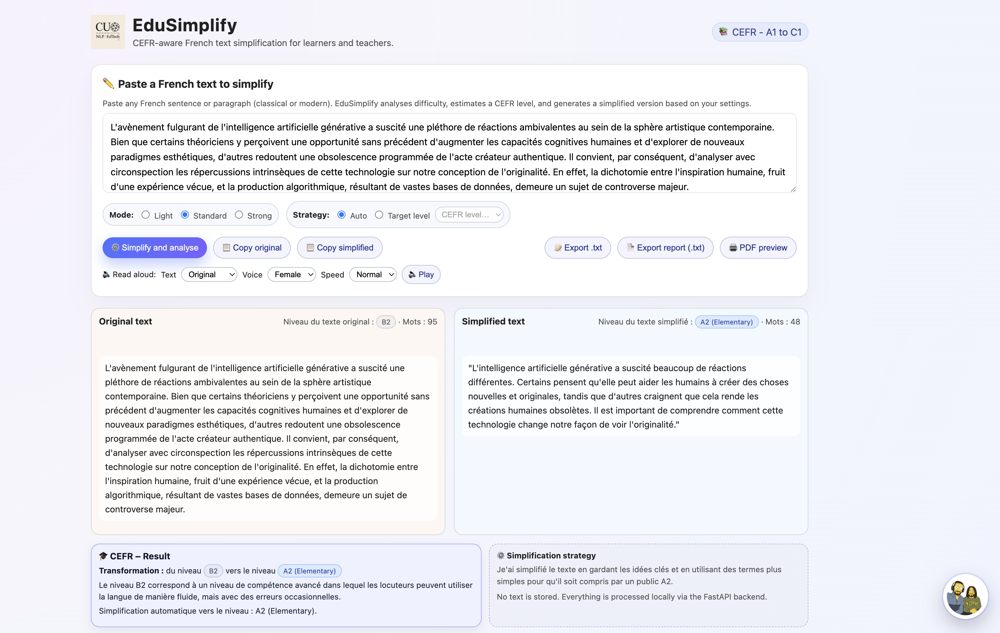
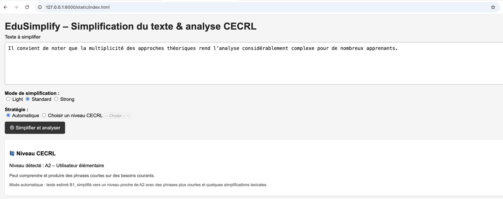

<p align="center">
  
</p>

<h1 align="center">EduSimplify</h1>

<p align="center">
A CEFR-aligned French text simplification system for learners, educators, and researchers.
</p>

---

## Overview

**EduSimplify** is a modern NLP-powered tool designed to simplify French texts from classical literature, academic writing, and educational contexts.  
It supports **A1 to C1 simplification**, CEFR-aligned transformation strategies, lexical frequency analysis, sentence splitting, and text-to-speech.

The tool helps:

- students who struggle with complex French texts  
- teachers preparing differentiated learning materials  
- researchers working on readability and CEFR modeling  

---

## Features

### CEFR-aligned simplification (A1 → C1)
- A1/A2 → short sentences, high-frequency words only  
- B1/B2 → moderate simplification  
- C1 → *elevated* academic reformulation  

### Advanced linguistic processing
- spaCy morpho-syntactic parsing  
- Zipf frequency (wordfreq) for rarity detection  
- multi-word expression simplification  
- syntactic simplification and segmentation  

### Interactive interface
- side-by-side analysis  
- lexical difficulty highlighting  
- CEFR-level inference (auto mode)  
- male/female voice text-to-speech (slow, normal, fast)

---

## Screenshots

<p align="center">
  
</p>

<p align="center">
  
</p>

---

## Full Academic Breakdown  
*(Research background, linguistic analysis, experiment data, CEFR justification, classical literature challenges, etc.)*

<p align="center">
  <a href="docs/README_academic.md">
    
  </a>
</p>

---

## Installation

### 1. Clone the repo

```bash
git clone https://github.com/Conyekp2/EduSimplify.git
cd EduSimplify
```
### 2. Create a virtual environment
```bash
python3 -m venv .venv
source .venv/bin/activate
```
### 3. Install dependencies
```
pip install -r requirements.txt
python -m spacy download fr_core_news_sm
```
### 4. Run API
```
uvicorn app.main:app --reload
```
### 5. Open interface
```
http://127.0.0.1:8000/static/index.html
```
## Project structure
```
EduSimplify/
├── app/
│   ├── main.py               # FastAPI backend
│   ├── simplify.py           # Simplification pipeline
│   ├── cefr.py               # CEFR-level analysis
│
├── static/
│   ├── index.html            # Web interface (UI)
│
├── images/
│   ├── logo.png
│   ├── interfaceTEXT.png
│   ├── interfaceCECRL.png
│
├── docs/
│   ├── README_academic.md    # Full academic documentation
│
├── requirements.txt
└── README.md
```

## Roadmap
add bilingual FR ↔ EN mode
add paraphrase & back-translation via LLMs
train supervised CEFR classifier
export reports (PDF/Markdown)
advanced cultural simplification
improved neural TTS voices

## Author
Chinedu Onyekpere  
NLP ‧ EdTech ‧ FLE ‧ Applied Linguistics  
LinkedIn: https://www.linkedin.com/in/chinedu-onyekpere-5a89912a4